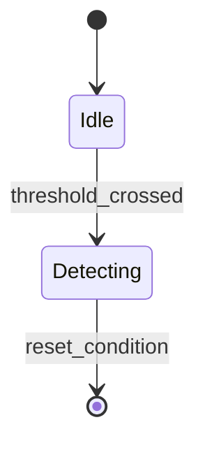

# Rendering Diagrams from Specifications

How to consume machine-readable diagram specifications (from loom-requirement-analysis or other sources) and generate optimized Mermaid diagrams.

## Purpose

- **Automatic diagram generation** from structured data
- **Consistent styling** across all requirement diagrams
- **Optimized layouts** with minimal line crossings
- **Automatic splitting** of complex diagrams into multiple digestible views

## Input: Diagram Specification JSON

The diagram spec format is defined in `loom-requirement-analysis/references/diagram-specification.md`. Key fields:

```json
{
  "diagram_type": "flowchart | state_machine | sequence | data_flow",
  "title": "Diagram title",
  "complexity": "simple | medium | complex",
  "should_split": true/false,
  "nodes": [...],
  "edges": [...],
  "subgraphs": [...],
  "style_classes": {...},
  "layout_hints": {...}
}
```

## Workflow

### 1. Load Diagram Spec

When passed a diagram spec file path (or JSON object):

```javascript
// Typical usage in HTML generation
const spec = JSON.parse(readFile('req-5399-event-detection-spec.json'));
```

### 2. Check if Splitting is Needed

```javascript
if (spec.should_split && spec.split_points) {
  // Generate multiple diagrams
  spec.split_points.forEach(split => {
    split.create_diagrams.forEach(diagram_def => {
      generateDiagram(diagram_def, spec);
    });
  });
} else {
  // Generate single diagram
  generateDiagram(spec, spec);
}
```

### 3. Generate Mermaid Syntax

Transform the spec into Mermaid syntax following the template patterns:

#### Flowchart Template

```mermaid
graph TD
    %% Subgraphs first
    subgraph inputs["External Inputs (CAN)"]
        A[Node Label<br/>Sublabel 1<br/>Sublabel 2]
        B[Another Node]
    end
    
    subgraph processing["Processing Logic"]
        C{Decision Node}
        D[Process Node]
    end
    
    %% Edges - organize by importance
    %% Primary paths (solid lines)
    A --> C
    C -->|Condition| D
    
    %% Secondary paths (dashed lines)
    C -.->|Error| E
    
    %% Style classes
    classDef inputStyle fill:#1a3a2e,stroke:#34d399,stroke-width:2px
    classDef processStyle fill:#1e2a3a,stroke:#1fb6d6,stroke-width:2px
    
    class A,B inputStyle
    class C,D processStyle
```



### 4. Apply Layout Optimizations

Use the `layout_hints` from the spec:

#### minimize_crossings
- Order edge declarations to match `node_order` array
- Group related nodes in same subgraph
- Place decision nodes strategically based on fan-out

#### separate_error_paths
- Use dashed lines (`-.->`) for edges where `importance: "secondary"`
- Visually distinguish main flow from error/reset flows

#### group_related
- Keep nodes with `group` field in same subgraph
- Order nodes within subgraph by `node_order`

### 5. Generate Container HTML/CSS

Based on complexity, set appropriate container sizing:

```javascript
function getContainerHeight(spec) {
  const nodeCount = spec.nodes.length;
  if (spec.complexity === 'simple' || nodeCount < 8) return '400px';
  if (spec.complexity === 'medium' || nodeCount < 15) return '600px';
  return '800px'; // complex
}
```

```css
.mermaid-wrap {
  min-height: 600px; /* from getContainerHeight() */
  padding: 60px 40px;
  /* ... other styles from css-patterns.md */
}
```

### 6. Apply Theme Variables

Use the style_classes from spec to generate Mermaid themeVariables:

```javascript
mermaid.initialize({
  theme: 'base',
  themeVariables: {
    fontFamily: 'IBM Plex Sans, system-ui, sans-serif',
    fontSize: '16px',
    primaryColor: spec.style_classes.processStyle.fill,
    primaryBorderColor: spec.style_classes.processStyle.stroke,
    // ... map all style classes
  }
});
```

## Node Type Rendering

### input nodes
```mermaid
A[LongitudinalAcceleration<br/>Source: EBS<br/>Bus: J1939_1]
```
- Rectangle with rounded corners
- Green border (`#34d399`)
- Multi-line label with metadata

### decision nodes
```mermaid
C{Time Debounce<br/>Filter<br/>AccTimeValidStatus}
```
- Diamond shape
- Cyan border (`#1fb6d6`)
- Multi-line label

### process nodes
```mermaid
D[Start HarshAccTimer<br/>Set HarshAccCounterSts = True]
```
- Rectangle
- Cyan border (`#1fb6d6`)
- Action-oriented label

### state nodes (for state machines)

- Rounded rectangle
- State name + entry/exit actions if complex

## Edge Rendering

### Solid edges (primary flow)
```mermaid
A --> B
A -->|Condition| B
```

### Dashed edges (secondary flow)
```mermaid
A -.->|Error| B
A -.->|Reset| B
```

### Dotted edges (weak dependency)
```mermaid
A -..->|Optional| B
```

## Subgraph Rendering

Group related nodes and apply consistent styling:

```mermaid
subgraph inputs["External Inputs (CAN)"]
    A[...]
    B[...]
end

subgraph detection["REQ-5399: Event Detection Logic"]
    C{...}
    D[...]
end
```

## Handling Complex Diagrams (Splitting)

When `should_split: true`:

### Option 1: Multiple Sections in Same HTML

Generate multiple `.mermaid-wrap` containers in sequence:

```html
<h3>Main Detection Flow</h3>
<div class="mermaid-wrap">
  <!-- Diagram 1 -->
</div>

<h3>Error Handling and Resets</h3>
<div class="mermaid-wrap">
  <!-- Diagram 2 -->
</div>
```

### Option 2: Tabs/Collapsible Sections

Use `<details>` or tabs to organize multiple related diagrams:

```html
<div class="diagram-tabs">
  <button data-tab="main">Main Flow</button>
  <button data-tab="errors">Error Handling</button>
</div>

<div id="main-diagram" class="mermaid-wrap">...</div>
<div id="errors-diagram" class="mermaid-wrap" style="display:none">...</div>
```

### Transition Nodes

When splitting, add transition nodes to show connections:

```mermaid
graph TD
    A[Input] --> B{Decision}
    B -->|Error| TRANS[→ See Error Handling diagram]
    
    style TRANS fill:#2a1e3a,stroke:#818cf8,stroke-dasharray: 5 5
```



## Complete Example

Given spec file `req-5399-event-detection-spec.json`:

```javascript
// 1. Load spec
const spec = require('./req-5399-event-detection-spec.json');

// 2. Generate Mermaid syntax
function generateMermaid(spec) {
  let mermaid = `graph ${spec.layout_direction}\n`;
  
  // Add subgraphs
  spec.subgraphs.forEach(sg => {
    mermaid += `    subgraph ${sg.id}["${sg.label}"]\n`;
    sg.node_ids.forEach(nodeId => {
      const node = spec.nodes.find(n => n.id === nodeId);
      mermaid += `        ${node.id}[${node.label}`;
      if (node.sublabels) {
        mermaid += '<br/>' + node.sublabels.join('<br/>');
      }
      mermaid += ']\n';
    });
    mermaid += '    end\n\n';
  });
  
  // Add edges (primary first, then secondary)
  const primaryEdges = spec.edges.filter(e => e.importance === 'primary');
  const secondaryEdges = spec.edges.filter(e => e.importance === 'secondary');
  
  primaryEdges.forEach(edge => {
    const arrow = edge.style === 'solid' ? '-->' : '-.->'; 
    const label = edge.label ? `|${edge.label}|` : '';
    mermaid += `    ${edge.from} ${arrow}${label} ${edge.to}\n`;
  });
  
  secondaryEdges.forEach(edge => {
    const arrow = edge.style === 'dashed' ? '-.->': '-->';
    const label = edge.label ? `|${edge.label}|` : '';
    mermaid += `    ${edge.from} ${arrow}${label} ${edge.to}\n`;
  });
  
  // Add style classes
  mermaid += '\n';
  Object.keys(spec.style_classes).forEach(className => {
    const style = spec.style_classes[className];
    mermaid += `    classDef ${className} fill:${style.fill},stroke:${style.stroke},stroke-width:${style.stroke_width}\n`;
  });
  
  // Apply classes to nodes
  const groupedNodes = {};
  spec.nodes.forEach(node => {
    if (!groupedNodes[node.style_class]) groupedNodes[node.style_class] = [];
    groupedNodes[node.style_class].push(node.id);
  });
  
  Object.keys(groupedNodes).forEach(className => {
    mermaid += `    class ${groupedNodes[className].join(',')} ${className}\n`;
  });
  
  return mermaid;
}

// 3. Insert into HTML
const mermaidCode = generateMermaid(spec);
const html = `
<div class="mermaid-wrap" style="min-height: ${getContainerHeight(spec)}">
  <div class="zoom-controls">
    <button onclick="zoomDiagram(this, 1.2)">+</button>
    <button onclick="zoomDiagram(this, 0.8)">&minus;</button>
    <button onclick="resetZoom(this)">&#8634;</button>
  </div>
  <pre class="mermaid">${mermaidCode}</pre>
</div>
`;
```

## Best Practices

1. **Always load the spec file** — don't manually write Mermaid syntax
2. **Respect layout hints** — use node_order and edge ordering to minimize crossings
3. **Use appropriate container sizing** — based on complexity and node count
4. **Apply consistent theming** — map style_classes to Mermaid themeVariables
5. **Split when needed** — don't force complex diagrams into single view
6. **Add transition nodes** — when splitting, show connections between diagrams
7. **Test both zoom and pan** — ensure controls work for all diagram sizes

## Error Handling

If diagram spec is malformed or missing:
- Log clear error message
- Fall back to generating diagram manually (but log warning)
- Never fail silently — diagram specs should be validated

## Future Enhancements

- **Automatic layout optimization algorithms** (force-directed, hierarchical)
- **Interactive diagram editing** (click node to highlight connections)
- **Export to other formats** (SVG, PNG, PlantUML)
- **Diff visualization** (compare two requirement versions via spec diff)
